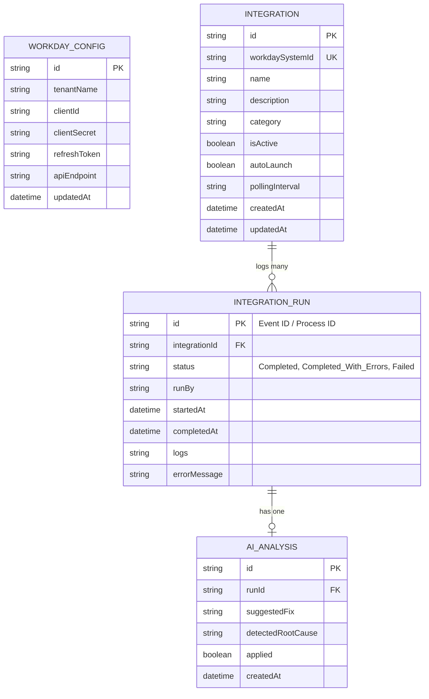

# Database Schema Design & Documentation

This document describes the schema design, table definitions, relationships, and fields for the Workday Integration Monitoring System.

---

## 1. ORM & Database Engine
- **Database Engine**: PostgreSQL (Neon Serverless Cloud Database)
- **ORM**: Prisma (for schema migration, type-safety, and query building)

---

## 2. Entity Relationship Diagram (ERD)



---

## 3. Detailed Data Dictionary

### 3.1. `WorkdayConfig` Table
Stores global configuration parameters to authorize Workday API calls.

| Field Name | Type | Constraints | Description |
| :--- | :--- | :--- | :--- |
| `id` | UUID / String | PK, Default: UUID | Unique identifier. |
| `tenantName` | String | Not Null | Name of the Workday tenant (e.g., `Dpt3`). |
| `clientId` | String | Not Null | Client ID generated in Workday Register API Client. |
| `clientSecret`| String | Not Null | Client secret key. |
| `refreshToken`| String | Not Null | Long-lived refresh token. |
| `apiEndpoint` | String | Not Null | Root API URL (e.g. `https://wd3-impl-services1.workday.com`). |
| `updatedAt` | DateTime | Not Null | Record updated timestamp. |

### 3.2. `Integration` Table
Stores registered integrations matching Workday System IDs.

| Field Name | Type | Constraints | Description |
| :--- | :--- | :--- | :--- |
| `id` | UUID / String | PK, Default: UUID | Unique internal identifier. |
| `workdaySystemId` | String | Unique, Not Null | Workday identifier for the Integration System (e.g. `INT_SYS_001`). |
| `name` | String | Not Null | Name of the integration. |
| `description` | String | Nullable | Detail notes. |
| `category` | String | Nullable | Optional type (e.g., `Finance`, `HCM`, `Payroll`). |
| `isActive` | Boolean | Default: `true` | Poller will check status only if `isActive = true`. |
| `autoLaunch` | Boolean | Default: `false` | If true, transient failures automatically trigger a relaunch. |
| `pollingInterval`| String | Default: `10m` | Configured polling frequency (e.g., `10m`, `30m`, `1h`, `1d`). |

### 3.3. `IntegrationRun` Table
Tracks status events pulled from Workday's `Get_Integration_Events` payload records.

| Field Name | Type | Constraints | Description |
| :--- | :--- | :--- | :--- |
| `id` | String | PK (Workday Event ID) | Background Process Instance ID returned by Workday. |
| `integrationId` | UUID / String | FK $\rightarrow$ `Integration.id`, OnDelete: Cascade | References registered integration parent. |
| `status` | String | Not Null | Status text from Workday (e.g. `Completed`, `Completed_With_Errors`, `Failed`, `Processing`). |
| `runBy` | String | Nullable | Account name that triggered the integration. |
| `startedAt` | DateTime | Not Null | Initiated date/time. |
| `completedAt` | DateTime | Nullable | Completed date/time. |
| `logs` | String (Text) | Nullable | Complete run execution text / logs downloaded from Workday. |
| `errorMessage` | String (Text) | Nullable | Extracted summary of failed details. |

---

## 4. Prisma Schema Definition

```prisma
datasource db {
  provider = "postgresql"
  url      = env("DATABASE_URL")
}

generator client {
  provider = "prisma-client-js"
}

model WorkdayConfig {
  id           String   @id @default(uuid())
  tenantName   String   @map("tenant_name")
  clientId     String   @map("client_id")
  clientSecret String   @map("client_secret")
  refreshToken String   @map("refresh_token")
  apiEndpoint  String   @map("api_endpoint")
  updatedAt    DateTime @updatedAt @map("updated_at")

  @@map("workday_configs")
}

model Integration {
  id              String           @id @default(uuid())
  workdaySystemId String           @unique @map("workday_system_id")
  name            String
  description     String?
  category        String?
  isActive        Boolean          @default(true) @map("is_active")
  autoLaunch      Boolean          @default(false) @map("auto_launch")
  pollingInterval String           @default("10m") @map("polling_interval")
  runs            IntegrationRun[]
  createdAt       DateTime         @default(now()) @map("created_at")
  updatedAt       DateTime         @updatedAt @map("updated_at")

  @@map("integrations")
}

model IntegrationRun {
  id            String       @id // Background Process Instance ID (from Workday)
  integrationId String       @map("integration_id")
  integration   Integration  @relation(fields: [integrationId], references: [id], onDelete: Cascade)
  status        String       // Completed, Completed_With_Errors, Failed, Processing
  runBy         String?      @map("run_by")
  startedAt     DateTime     @map("started_at")
  completedAt   DateTime?    @map("completed_at")
  logs          String?
  errorMessage  String?      @map("error_message")
  aiAnalysis    AiAnalysis?

  @@map("integration_runs")
}

model AiAnalysis {
  id                 String         @id @default(uuid())
  runId              String         @unique @map("run_id")
  run                IntegrationRun @relation(fields: [runId], references: [id], onDelete: Cascade)
  suggestedFix       String         @map("suggested_fix")
  detectedRootCause  String         @map("detected_root_cause")
  applied            Boolean        @default(false)
  createdAt          DateTime       @default(now()) @map("created_at")

  @@map("ai_analyses")
}
```
